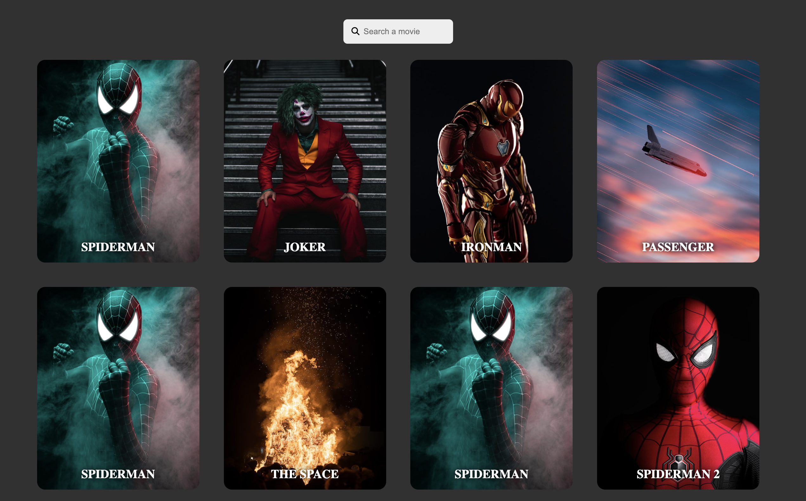

# Movies Image gallery

> A simple project about movies poster gallery.

## Table of contents

- [Movies Image gallery](#movies-image-gallery)
  - [Table of contents](#table-of-contents)
  - [General info](#general-info)
  - [Screenshots](#screenshots)
  - [Technologies](#technologies)
  - [Setup](#setup)
  - [Code Examples](#code-examples)
  - [Features](#features)
  - [Status](#status)

## General info

> The objective of the project is to practice separation of concern in
> JavaScript.

## Screenshots



## Technologies

- JavaScript
- HTML5
- CSS3
- VSC code

## Setup

clone the repo npm install and start

## Code Examples

```js
const loadKeyupHandler = () => {
	// load all movie
	data.movies.forEach((movie) => {
		const card = createCard(movie);
		dom.cardContainer.append(card);
	});

	// filter movie
	dom.input.addEventListener('keyup', () => {
		const value = dom.input.value.toLowerCase();
		const movies = data.movies;
		const filterMovie = searchMovies(movies, value);

		dom.cardContainer.innerHTML = '';
		filterMovie.forEach((movie) => {
			const card = createCard(movie);
			dom.cardContainer.append(card);
		});
	});
};
```

## Features

List of features ready and Todos for future development

- used load event
- used keyUp event
- filter movie using input value

## Status

Project is: _Done_
